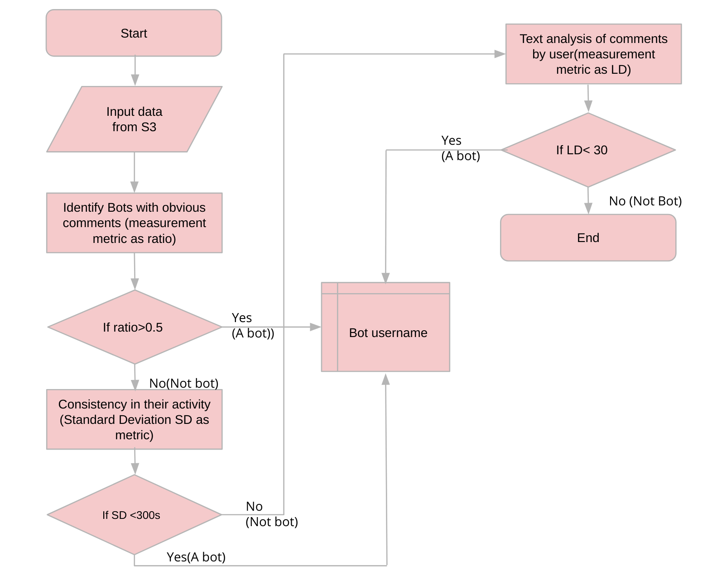

# Data Engineering

## Bot detection on reddit using user activity and the comments they make

## Team

For now I am only the one.

 
### Motivation
  - Millions of  users in social media e.g. facebook, twitter and social forums reddit and ecommerce sites amazon, ebay.
  -	Users may find that certain pages are generating a lot of bot traffic – while others are ignored
  -	Bad bots, such as click bots, download bots, and imposter bots can negatively impact a site’s performance.
  -	When a website loads slower than usual, potential customers may look elsewhere for the information, product or service they desire.
  -	Monitoring bot activity for the organization helps to prevent issues and provides insights how easily are the users able to access the right priority pages.

## Proposed Solution

  - Botactivity in reddit gives insight of activities of bots present in the user community in reddit.
  - Presents all the subreddits community that has bots deployed in them.
  - Presents all the username of the bots and their associated subreddit communities.
  - All analytics for finding the bots done based on text-mining the users comments.
  - Bots show some kind of pattern while writing comments.
  - Identify the pattern and flag them as bots.

## Input Schema

 
	
## Pipeline

 
 
## Spark analytics in steps
 	
 
 
## Hardware

-Currently

1 Master
-	6 cores, 6GB Memory, 100 EBS

4 Workers
-	8 cores, 32GB Memory, 100 EBS

## Use cases

 -  Visulaize bot activites 
 -  Track and block bad bots
 -  Chatbots activities

## Stretch Goals
 
 -	The project is solely based on detecting bots with metrics that derives from timestamp and comments(text).
 -	So not all bots could be detetced if they throw in subtle sign and almost close to pass Turing Test.
 -	This project will be part of Machine learning pipeline where the obtained datasets could be part of Training data sets.